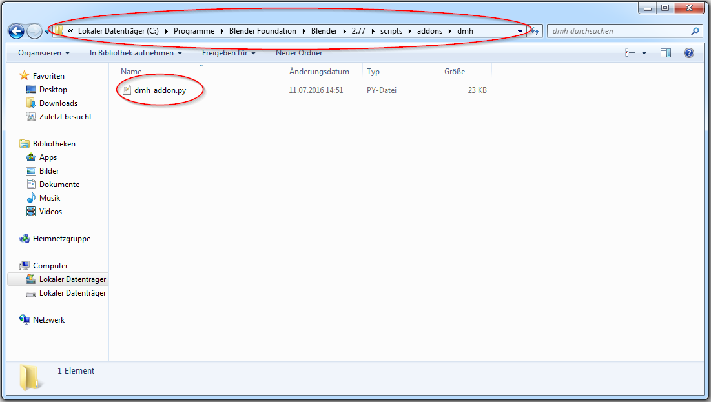
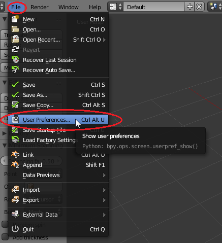
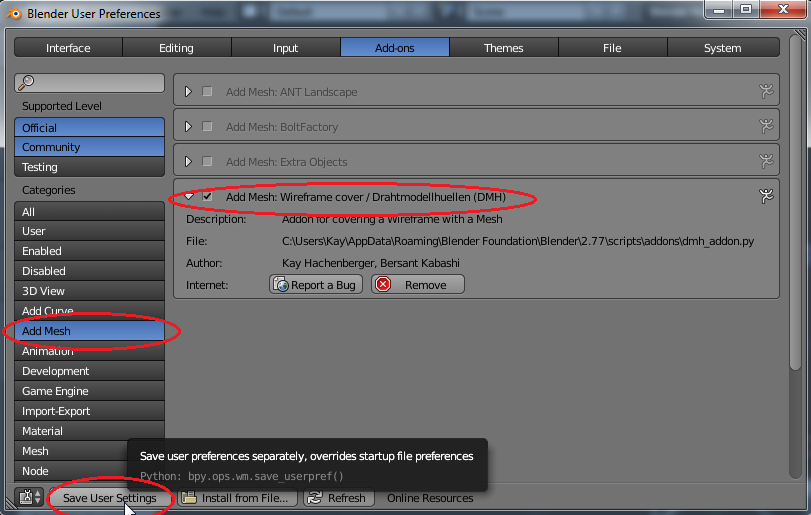

Installation Guide
==================

1. Download the file "dmh_addon.py" from https://github.com/Hachenberger/Studienprojekt

2. Copy "dmh_addon.py" into a new folder in the Blender Script folder:

   
3. Start Blender and choose File->User Preferences:

4. Choose "Add Mesh" at the left menu and mark the checkbox next to the DMH-AddOn. At last click "Save User Settings":

The AddOn is installed and can be used.

.. note::

    If you have any troubles updating the AddOn, please try "Install from file" in the User Preferences.