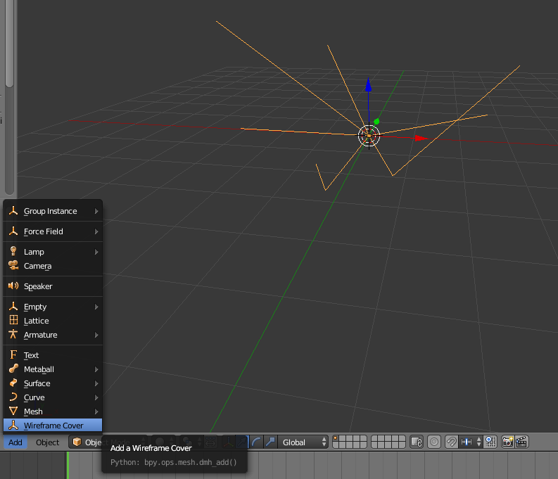
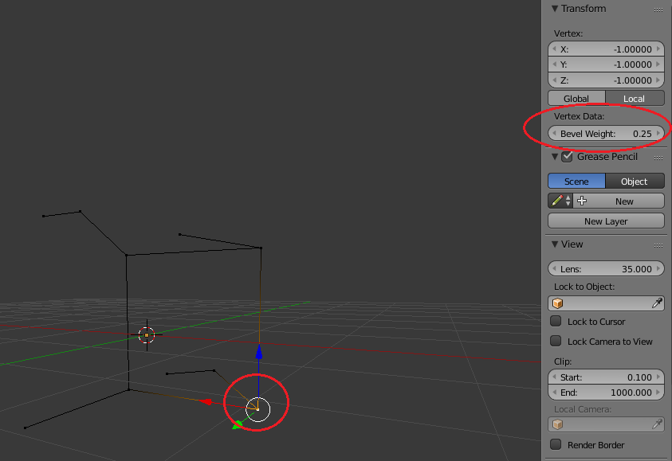
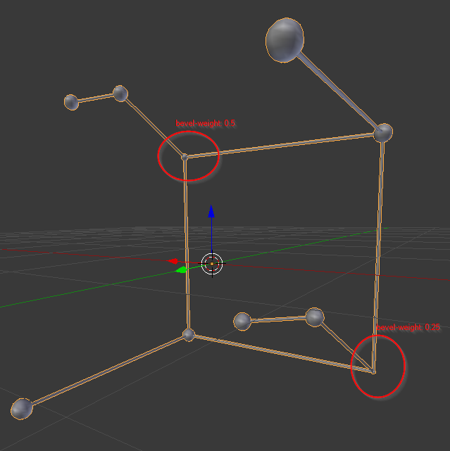
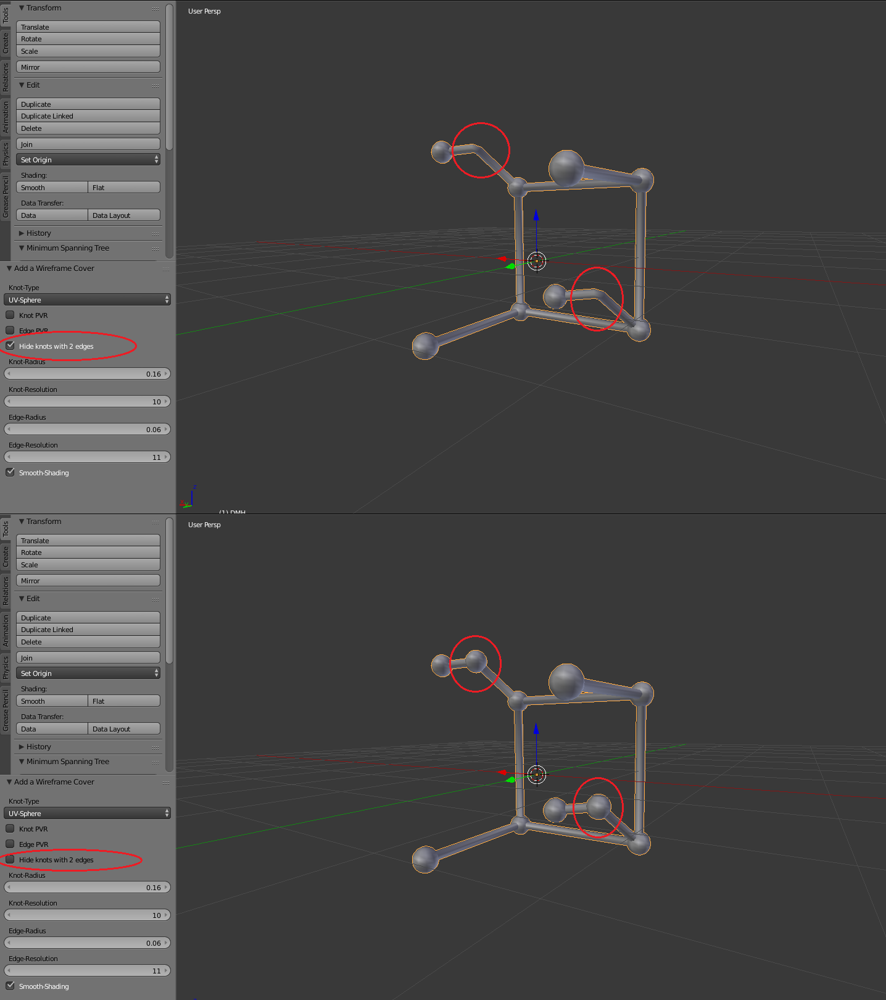

DMH User Manual
===============

.. image:: logo.png

Adding Wireframe Cover
----------------------

Select the wireframe that you want to cover in 3D View. Click on "Add" and choose "Wireframe Cover" as shown in the picture.

Choose the featured options
---------------------------

Your first wireframe cover is shown in the 3D View. You can now choose between all the options shown in the picture. The changes will be shown in the 3D View.

.. image:: Step2.png
   :scale: 50 %
   :align: center
   
Knot-Type
^^^^^^^^^

hier kommt noch was

Knot Pro-Vertex-Radius (PVR)
------------------------------
Use the PVR option to manually scale knots. Just set a bevel-weight for each vertex of the source wireframe. The bevel-weights will act as a scaling factor.

Setting bevel-weight:

The knots will be scaled:

.. note::

    Bevel-weights are set to 0.0 if you dont change them. A bevel-weight of 0.0 will fully hide the knot.

Hide knots with two edges
------------------------------

To hide knots with only two edges choose this option. In the following picture you can see the effect.

